# 环境搭建

统一使用Anaconda对深度学习环境进行管理

==注意==：最好使用带有英伟达显卡linux系统的电脑进行训练

1.首先下载anaconda3

2.安装好后，开机进入终端，会直接进入base环境下。

3.在终端使用`cd`指令进入该文件夹，使用下面命令安装环境

```
conda env create -f environment.yaml
```

4.从终端激活环境

```
conda activate py3
```

# YOLOv3-tiny

本部分代码主要使用yolov3-tiny作为检测网络，实现人脸口罩检测任务。

==参考代码的链接为：==

https://github.com/ultralytics/yolov3


## 模块介绍

本部分代码主要分为以下几个方面：

### cfg文件夹

里面存储的是经过修改输出类别个数的yolov3-tiny的网络结构

### data文件夹

train文件夹：存放所有的训练集图片及标签文件

val文件夹：存放所有的验证集图片及标签文件

make_vocdata.py: 产生train.txt 和val.txt文件来记录训练集和验证集的图片及标签路径

voc_lable.py:产生保存训练集和验证集图片路径的train.txt和val.txt文件

train.txt：保存有训练集图片路径

val.txt：保存有验证集图片路径

mask.data: 存储训练所需的类别、训练测试集位置等信息

mask.names：存储标签

### weights文件夹

里面存放训练后的模型文件和预训练模型

### utils文件夹

存储各类数据读取、模型结构、ap计算、nms计算等等多个模块

### samples文件夹

存储用于测试图片样例的文件夹

### outputimg文件夹

保存测试图片样例的检测结果图片

### hyp文件夹

存储超参数的训练测试结果 

### output文件夹

存储不同阈值下的precision和recall数值 和PR曲线

### models.py

构建yolov3-tniy模型

### train.py

训练网络模型的入口文件，包含训练过程 和超参数寻优

### test.py

测试训练好的模型在测试集上的结果，可以得到不同阈值下的PR曲线和map值

### detect.py

测试sample文件夹中的图片样例，并将输出的检测结果保存到output文件夹里。

打开摄像头实时运行抓取图像后读入可以得到检测结果并绘制边框在摄像头读取的图像上，而且实时输出检测所消耗时间。

### PR_curve.py

选取特定的阈值 读取eval_results中的Precision和Recall值，并且绘制PR曲线到eval_results文件夹

### hyp_plot.py

选取特定的超参数 读取eval_results中的超参数变化的loss值，并且绘制变化图到eval_results文件夹

### k_means.py

得到该数据集下的指定数量的anchor-boxes的大小 用以训练测试


## 训练过程

### 数据集准备

首先下载数据集[AIZOO数据集链接](https://cloud.tsinghua.edu.cn/d/af356cf803894d65b447/files/?p=%2FAIZOO%2F人脸口罩检测数据集.zip)

将下载的数据集解压后可以发现其中的文件夹分布如下：

```
-人脸口罩检测数据集/
	-train/
	-val/
	-数据说明
```

将其中的`train`文件夹和`val`文件夹放入`yolov3-tiny`文件夹中的`data`文件夹。这样就完成数据集的准备。

### 标签文件处理

然后通过terminal终端 使用`cd $you_path_to{yolov3-tiny}$ `命令进入`yolov3-tiny`文件夹。

==注==：$you_path_to{yolov3-tiny}$为伪代码 此处应该为你保存的文件夹路径

之后使用下述命令实现对训练、测试集的图片标签处理

```
cd data
python make_vocdata.py
python voc_label.py
cd ..
```

==注==：此处默认已经激活对应的python环境

### 下载预训练模型

本代码提供下载[预训练模型](https://cloud.tsinghua.edu.cn/d/1a84c0abc6a7446e96a2/)

下载之后可以找到其中文件名为`yolov3-tniy.conv.15`的文件

将其移动到放入`yolov3-tiny`文件夹中的`weights`文件夹。

### 训练网络

对于网络训练 首先在terminal终端进入`yolov3-tiny`文件夹，然后执行以下命令

```
python train.py --argument --epochs 5 --batch-size 10 --cfg cfg/yolov3-tiny-mask.cfg --data data/mask.data --weights weights/yolov3-tiny.conv.15  --device 0
```

==注==：其中值得解释的是`epochs`表示迭代的次数，`batch-size`表示batch大小，`device`表示使用nvidia的gpu代号，如果没有gpu可以传入`cpu`参数。

至此我们完成了网络的训练过程。

## mAP测试过程

对于训练得到的网络，测试其在不同阈值下的mAP结果的命令如下：

```
python test.py --cfg cfg/yolov3-tiny-mask.cfg --data data/mask.data --weights weights/best.pt --batch-size 10 --device 0 --iou-thres 0.6 --iouv 0.6
```

==注==：其中的`weights`参数代表所要测试的模型，`iou-thres`代表NMS的IoU阈值，`iouv`为计算mAP的IoU阈值，当其为0.6时代表mAP@[.5:.95]的值，其余分别代表mAP@iouv的值。

## 图片样例测试过程

首先需要将上一个文件夹中的`test-images`文件夹里的图片复制到`samples`文件夹里。

然后在当前文件夹使用以下命令：

```
python detect.py --cfg cfg/yolov3-tiny-mask.cfg --names data/mask.names --weights weights/best.pt --source ./samples --output outputimg
```

==注==：其中的`weights`参数代表所要测试的模型，`source`代表输入的图片样例的所在文件夹。

由此可以在文件夹`outputimg`中找到输出的结果。

## 下载训练好的模型测试图片和mAP样例

首先需要在此下载链接[训练模型](https://cloud.tsinghua.edu.cn/d/1a84c0abc6a7446e96a2/)

找到其中的`best_server.pt`文件下载后放入`weights`文件夹，后使用上述命令，但替换模型文件，即下述代码：

```
python detect.py --cfg cfg/yolov3-tiny-mask.cfg --names data/mask.names --weights weights/best_server.pt  --device 0 --source ./samples
```

==注==：其中的`weights`参数代表所要测试的模型，`source`代表输入的图片样例的所在文件夹，`--device`如果没有GPU，请选择cpu。

由此同样可以在文件夹`outputimg`中找到输出的结果。

对于该模型网络，测试其在不同阈值下的mAP结果的命令如下：

```
python test.py --cfg cfg/yolov3-tiny-mask.cfg --data data/mask.data --weights weights/best_server.pt --batch-size 10 --device 0 --iou-thres 0.6 --iouv 0.6
```

==注==：其中的`weights`参数代表所要测试的模型，`iou-thres`代表NMS的IoU阈值，`iouv`为计算mAP的IoU阈值，当其为0.6时代表mAP@0.5.0.95的值，其余分别代表mAP@iouv的值。

**下图为理想的输出结果图**：

`output`文件夹中的图片

**未佩戴口罩**

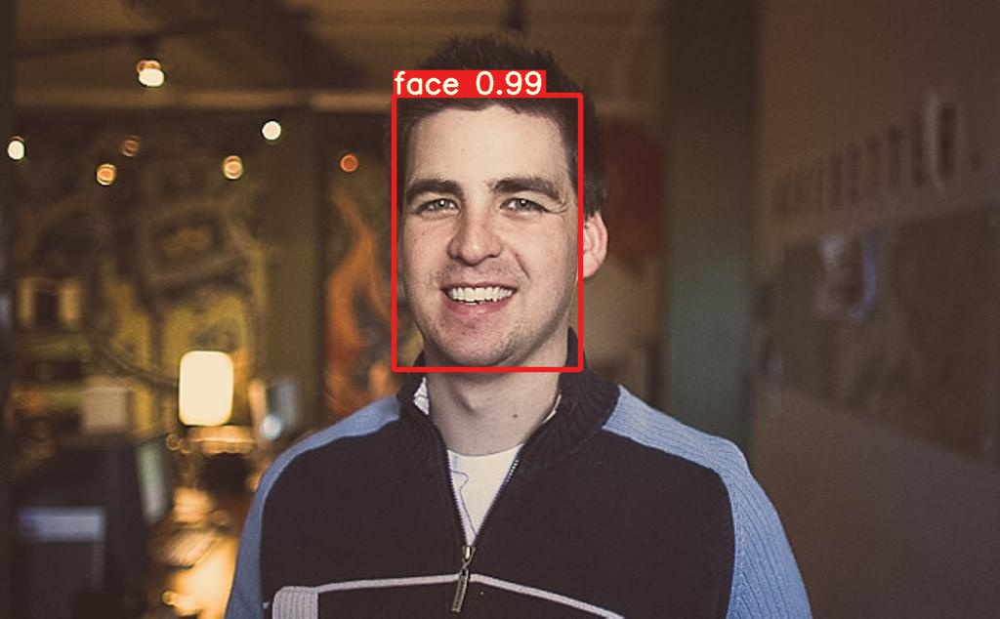

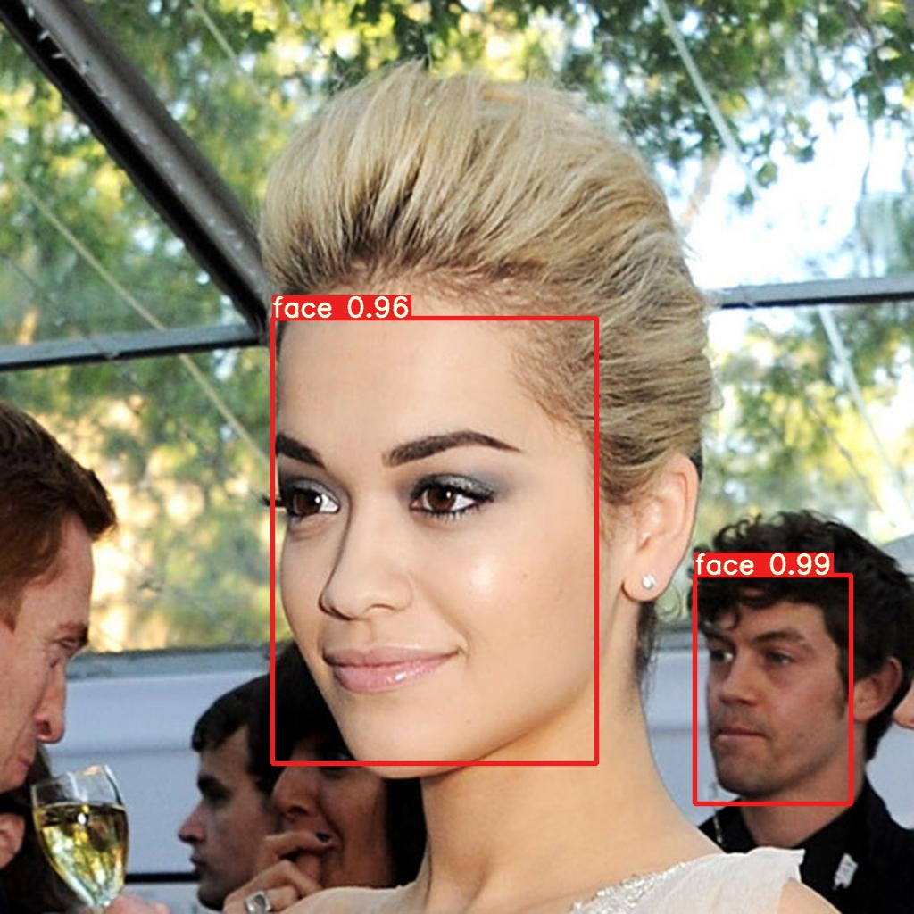

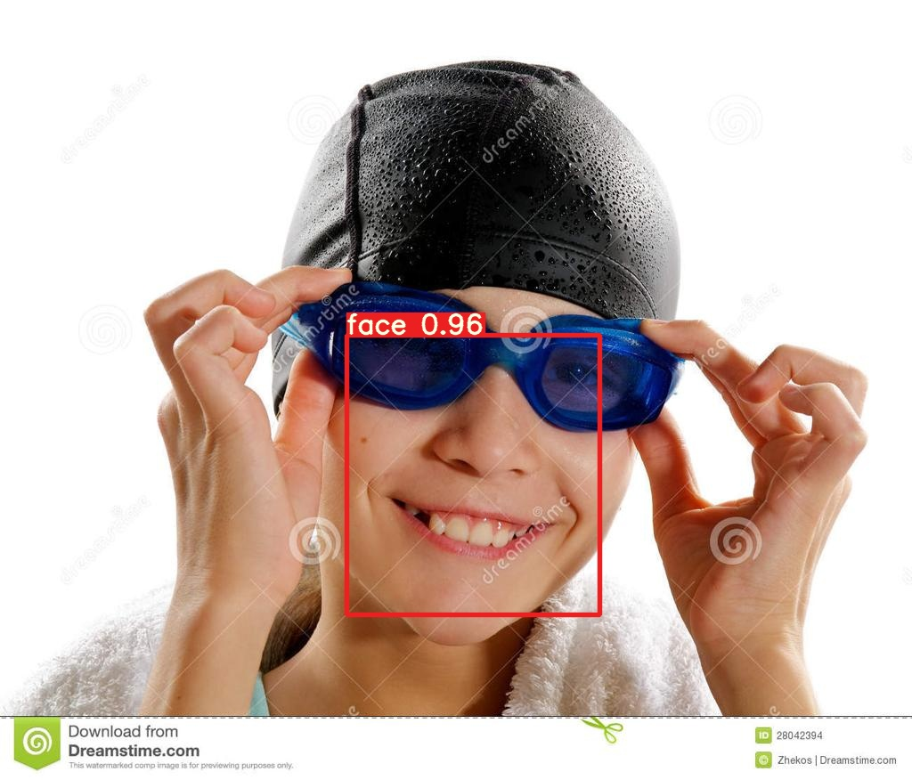

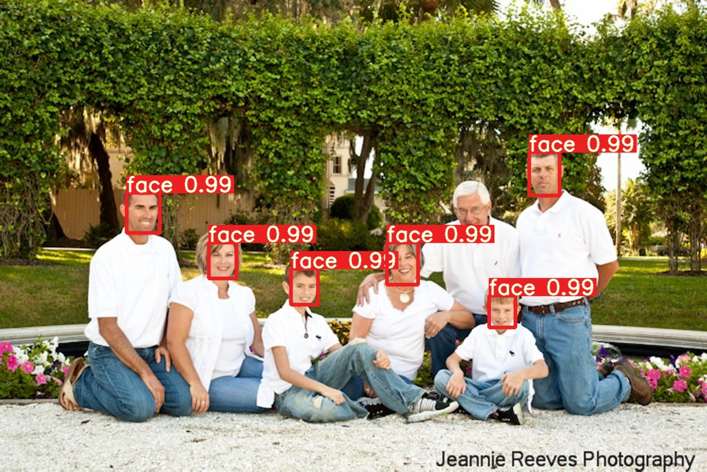

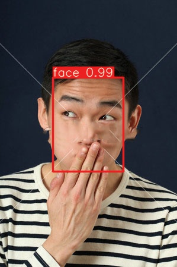


**佩戴口罩人脸**

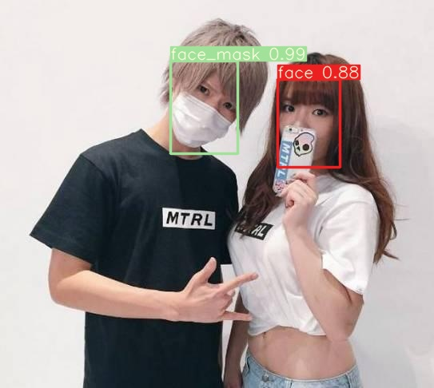


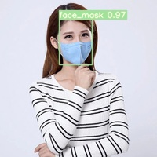

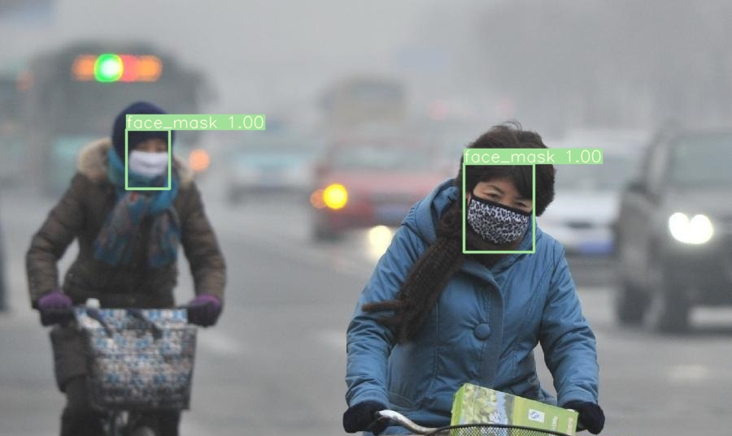

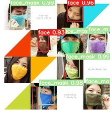


**理论的mAP@[.5:.95]及各类AP、P、R和F1值**

     			P        R        mAP@[.5:.95]  F1
     all       0.769     0.895     0.522     0.898
    face        0.72     0.897     0.502     0.884
    face_mask   0.817     0.892     0.542     0.911


# MobileNetV2-SSD-lite

本部分代码主要使用mobilenetv2作为基础网络，结合SSD算法的检测网络实现人脸口罩检测任务。

参考代码的链接：

https://github.com/qfgaohao/pytorch-ssd

## 模块介绍

主要包含以下几个模块：

### data文件夹

train文件夹：存放所有的训练集图片及标签文件

val文件夹：存放所有的验证集图片及标签文件

make_vocdata.py: 产生train.txt 和val.txt文件来记录训练集和验证集的图片及标签路径

labels.txt：记录标签

### eval_results文件夹

存储不同阈值下的precision和recall数值 和PR曲线

存储不同超参数的训练结果和图片

### models文件夹

存储训练好的模型 和预训练模型

还有标签分为：background face face_mask

### sample文件夹

保存测试图片样例的位置

### output文件夹

测试图片样例的结果

### vision文件夹

里面包含构建mobilenetv2和ssd算法基础的模块 此处不一一解释

### train_ssd.py

训练网络模型的入口文件，包含训练过程 和超参数寻优

### eval_ssd.py

测试训练好的模型在测试集上的结果，可以得到不同阈值下的PR曲线和map值

### run_ssd_example.py

测试sample文件夹中的图片样例，并将输出的检测结果保存到output文件夹里。

### run_ssd_live_demo.py

打开摄像头实时运行抓取图像后读入可以得到检测结果并绘制边框在摄像头读取的图像上，而且实时输出检测所消耗时间。

### PR_curve.py

选取特定的阈值 读取eval_results中的Precision和Recall值，并且绘制PR曲线到eval_results文件夹

### hyp_plot.py

选取特定的超参数 读取eval_results中的超参数变化的loss值，并且绘制变化图到eval_results文件夹


## 训练过程

首先下载数据集

## 训练过程

### 数据集准备

首先下载数据集[AIZOO数据集链接](https://cloud.tsinghua.edu.cn/d/af356cf803894d65b447/files/?p=%2FAIZOO%2F人脸口罩检测数据集.zip)

将下载的数据集解压后可以发现其中的文件夹分布如下：

```
-人脸口罩检测数据集/
	-train/
	-val/
	-数据说明
```

将其中的train文件夹和val文件夹放入`MobileNetV2-SSD-lite`文件夹中的`data`文件夹。这样就完成数据集的准备。

### 标签文件处理

然后通过terminal终端 使用`cd $you_path_to{MobileNetV2-SSD-lite}$ `命令进入`MobileNetV2-SSD-lite`文件夹。

==注==：$you_path_to{MobileNetV2-SSD-lite}$为伪代码 此处应该为你保存的文件夹路径

之后使用下述命令实现对训练、测试集的图片标签处理

```
cd data
python make_vocdata.py
cd ..
```

==注==：此处默认已经激活对应的python环境

### 下载预训练模型

本代码提供下载[预训练模型](https://cloud.tsinghua.edu.cn/d/1a84c0abc6a7446e96a2/)

下载之后可以找到其中文件名为`mb2-ssd-lite-mp-0_686.pth`的文件

将其移动到放入`MobileNetV2-SSD-lite`文件夹中的`models`文件夹。

### 训练网络

对于网络训练 首先在terminal终端进入`MobileNetV2-SSD-lite`文件夹，然后执行以下命令

```
python train_ssd.py --argument --datasets data --validation_dataset data --net mb2-ssd-lite --pretrained_ssd models/mb2-ssd-lite-mp-0_686.pth --num_epochs 20 --batch_size 64 --debug_steps 10 --use_cuda True
```

==注==：其中值得解释的是`epochs`表示迭代的次数，`batch-size`表示batch大小，`use_cuda`决定是否使用cuda，如果没有cuda可以使用 	`False`传入参数。

至此我们完成了网络的训练过程。

## mAP测试过程

对于训练得到的网络，测试其在不同阈值下的mAP结果的命令如下：

```
python eval_ssd.py --net mb2-ssd-lite --trained_model models/mb2-ssd-lite-Epoch-0-origin.pth --dataset data --label_file models/voc-model-labels.txt --iou_threshold 0.6
```

==注==：其中的`trained_model`参数代表所要测试的模型，`iou_threshold`为计算mAP的IoU阈值，当其为0.6时代表mAP@0.5.0.95的值，其余分别代表mAP@iou_threshold的值。

## 图片样例测试过程

首先需要将上一个文件夹中的`test-images`文件夹里的图片复制到`sample`文件夹里。

然后在当前文件夹使用以下命令：

```
python run_ssd_example.py mb2-ssd-lite models/mb2-ssd-lite-Epoch-19-origin.pth models/voc-model-labels.txt ./sample ./output
```

==注==：其中第2个参数代表所要测试的模型，`./output`代表输出的图片样例的所在文件夹。

由此可以在文件夹`output`中找到输出的结果。

## 下载训练好的模型测试图片和mAP样例

首先需要在此下载链接[训练模型](https://cloud.tsinghua.edu.cn/d/1a84c0abc6a7446e96a2/)

找到其中的` mb2-ssd-lite-Epoch-19-best.pth`文件下载后放入`models`文件夹，后使用上述命令，但替换模型文件，即下述代码：

```
python run_ssd_example.py mb2-ssd-lite models/mb2-ssd-lite-Epoch-19-best.pth models/voc-model-labels.txt ./sample ./output
```

==注==：其中第2个参数代表所要测试的模型，`./output`代表输出的图片样例的所在文件夹。可以在此处查看图片

由此同样可以在文件夹`outputimg`中找到输出的结果。

对于该模型网络，测试其在不同阈值下的mAP结果的命令如下：

```
python eval_ssd.py --net mb2-ssd-lite --trained_model models/mb2-ssd-lite-Epoch-19-best.pth --dataset data --label_file models/voc-model-labels.txt --iou_threshold 0.6
```

==注==：其中的`trained_model`参数代表所要测试的模型，`iou_threshold`为计算mAP的IoU阈值，当其为0.6时代表mAP@0.5.0.95的值，其余分别代表mAP@iou_threshold的值。

**结果展示**

**未佩戴口罩人脸**

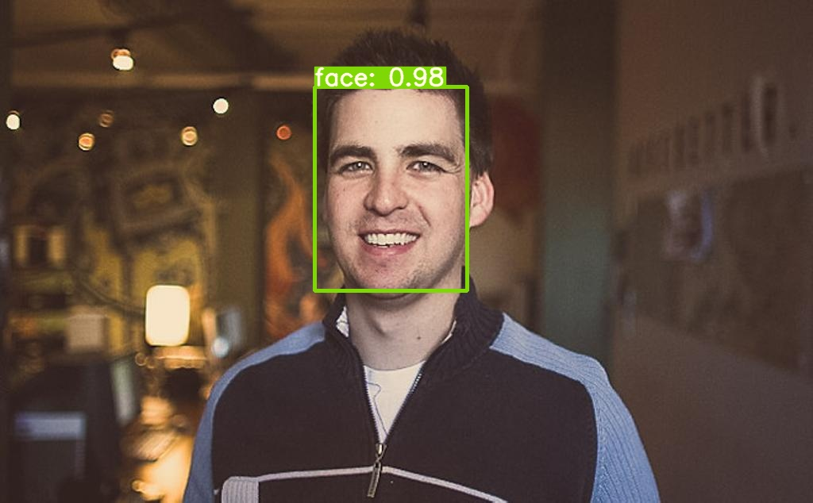


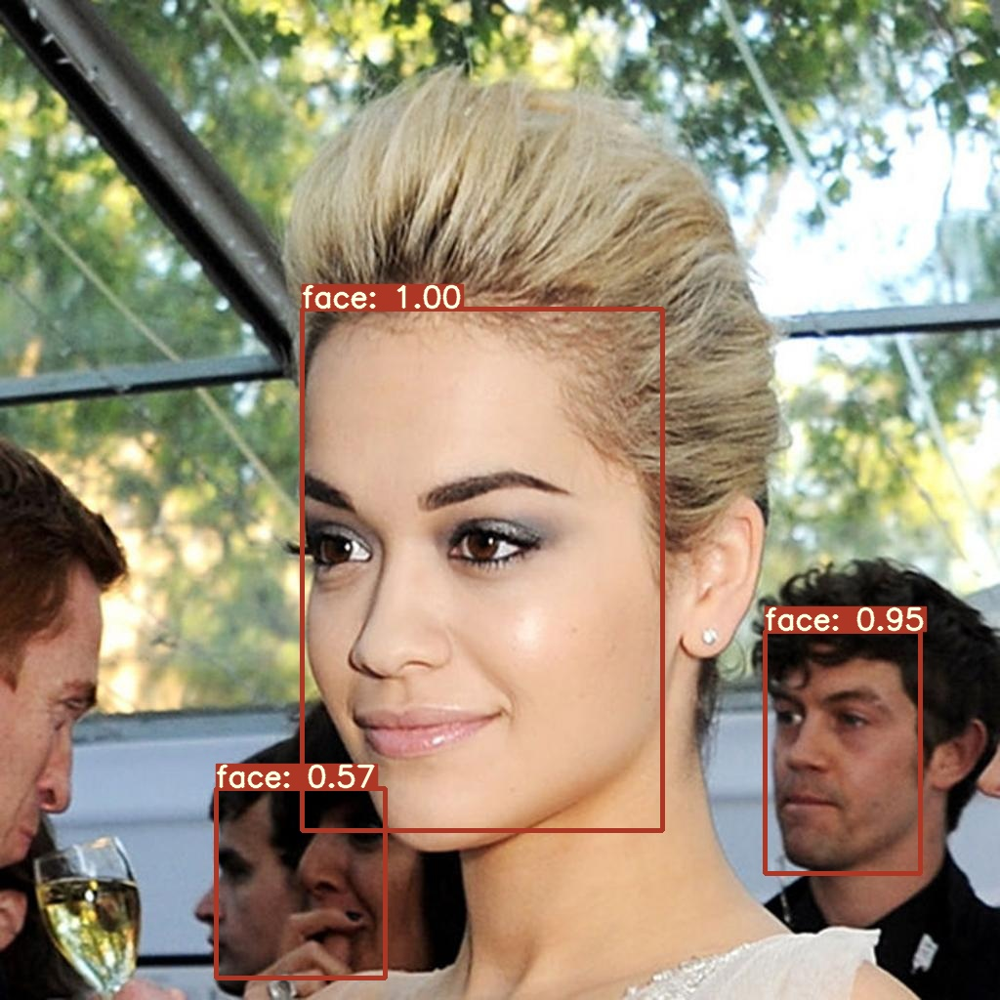

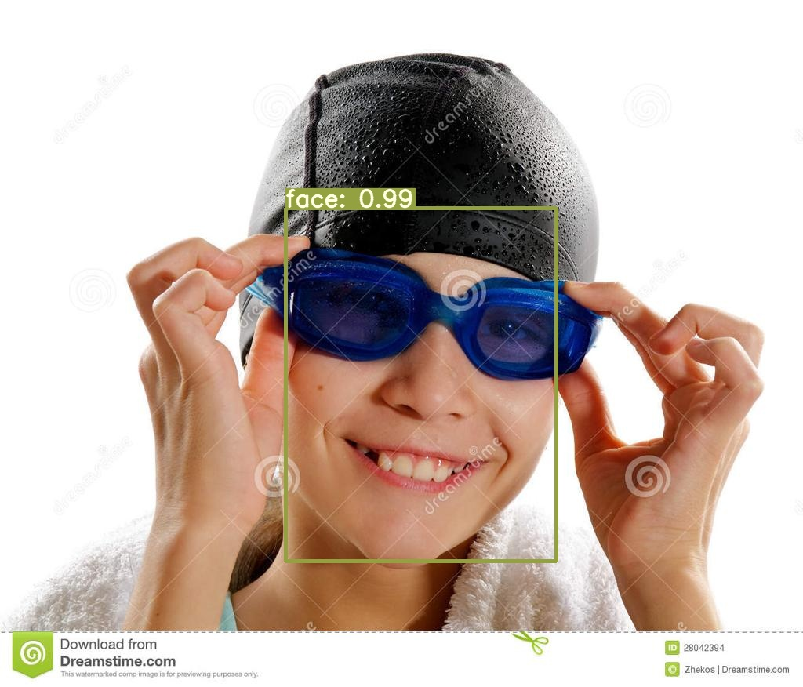

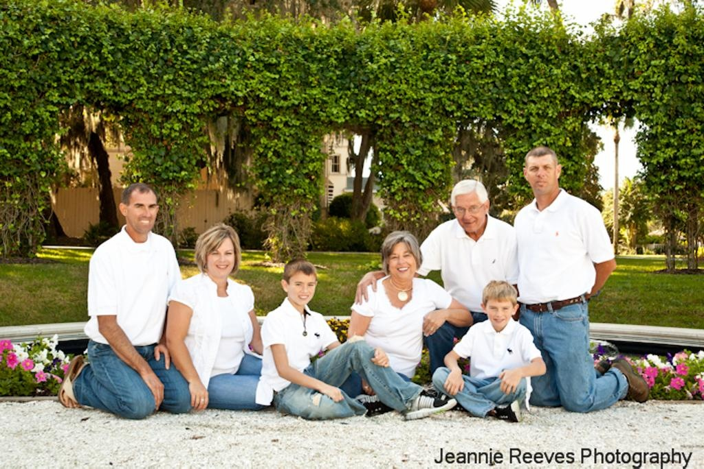

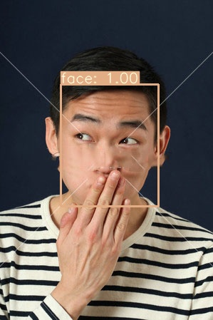

**佩戴口罩人脸**

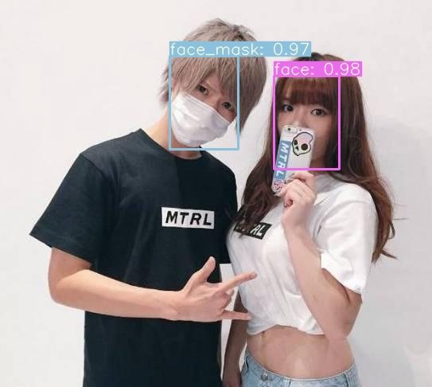

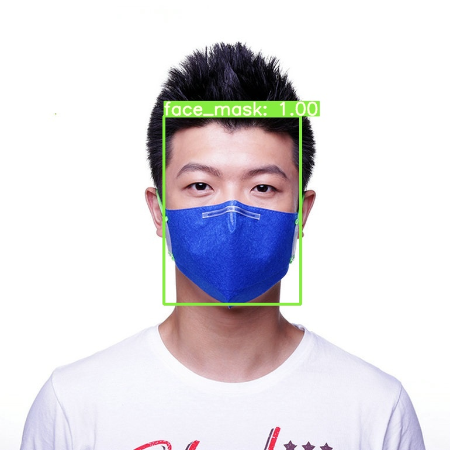

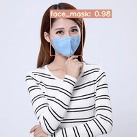

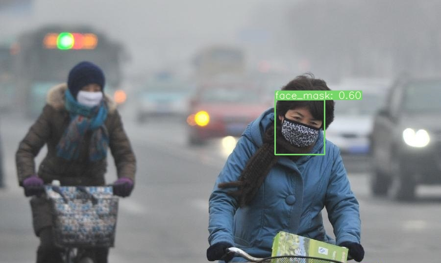

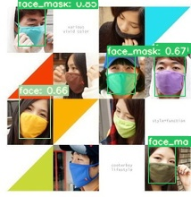


**mAP@[.5:.95]及各类AP的结果**

```
face: 0.403 
face_mask: 0.537 

Average Precision Across All Classes:0.470
```

